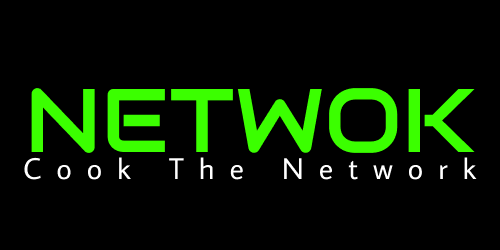

**NETWOK** is an all-in-one, Bash-based network automation toolkit designed for network engineers, system administrators, and IT professionals. It simplifies and automates a wide range of networking tasks. From diagnostics and configuration to device discovery, security auditing, and reporting, all through a single, easy-to-use CLI interface.